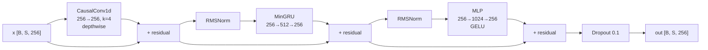

# MinGRU — Resumen de Arreglos y Arquitectura

> Fecha: 2026-03-17
> Archivos principales:
> - [mingru.rs](file:///c:/Users/Emabe/Documents/GitHub/xlstm/rust/src/blocks/minrnn/mingru.rs) — Implementación del módulo
> - [mingruchat.rs](file:///c:/Users/Emabe/Documents/GitHub/xlstm/rust/xorIA/mingruchat.rs) — Modelo de lenguaje 3 capas
> - [test_mingru.rs](file:///c:/Users/Emabe/Documents/GitHub/xlstm/rust/xorIA/bin/test_mingru.rs) — Tests de referencia (inline)
> - [test_mingru_lib.rs](file:///c:/Users/Emabe/Documents/GitHub/xlstm/rust/xorIA/bin/test_mingru_lib.rs) — Tests usando la librería

---

## 1. Arreglos Realizados

### 1.1 [log_cumsum_exp](file:///c:/Users/Emabe/Documents/GitHub/xlstm/rust/xorIA/bin/test_mingru.rs#27-37) — Estabilidad Numérica

> [!IMPORTANT]
> Este era el arreglo más crítico. La función anterior causaba NaN en `t=0` y gradientes inestables.

| Aspecto | Antes (inestable) | Después (estable) |
|---|---|---|
| **Centrado** | Solo `max_dim` | [(max + min) / 2](file:///c:/Users/Emabe/Documents/GitHub/xlstm/rust/xorIA/bin/test_mingru.rs#19-26) — centrado óptimo |
| **Clamp** | `clamp(-60, 0)` — destruía gradientes | Sin clamp — el centrado ya mantiene rango seguro |
| **Riesgo t=0** | [log(0) → NaN](file:///c:/Users/Emabe/Documents/GitHub/xlstm/rust/src/blocks/minrnn/mingru.rs#70-77) | Centrado evita underflow en `t=0` |

```diff
 fn log_cumsum_exp<B: Backend>(x: Tensor<B, 3>) -> Tensor<B, 3> {
-    let x_max = x.clone().max_dim(1).detach();
-    let x_stable = (x - x_max.clone()).clamp(-60.0, 0.0);
-    x_stable.exp().cumsum(1).log() + x_max
+    let max = x.clone().detach().max_dim(1);
+    let min = x.clone().detach().neg().max_dim(1).neg();
+    let m = (max + min) / 2.0;
+    (x - m.clone()).exp().cumsum(1).log() + m
 }
```

### 1.2 [parallel_scan_log](file:///c:/Users/Emabe/Documents/GitHub/xlstm/rust/src/blocks/minrnn/mingru.rs#78-98) — Eliminación de clamp de salida

```diff
-    log_h.clamp(-60.0, 60.0).exp().slice([0..b, 1..dims[1], 0..h])
+    log_h.exp().slice([0..b, 1..dims[1], 0..h])
```

> El `clamp(-60, 60)` recortaba la salida y distorsionaba los gradientes. Con el centrado óptimo en [log_cumsum_exp](file:///c:/Users/Emabe/Documents/GitHub/xlstm/rust/xorIA/bin/test_mingru.rs#27-37), ya no es necesario.

### 1.3 `MinGruChatModel::forward` — Estado h_0 persistente

> [!NOTE]
> En el notebook Python, `self.h_0` persiste entre batches. En Rust se ignoraba con `_states`.

```diff
-    pub fn forward(&self, input, _states: Option<...>) {
-        for layer in self.layers.iter() {
-            let (out, ns) = layer.forward(x, None);  // ← Siempre None!
+    pub fn forward(&self, input, states: Option<...>) {
+        let mut layer_states = states.unwrap_or_default();
+        // ... desempacar por capa ...
+        for layer in self.layers.iter() {
+            let state = if st.is_empty() { None } else { Some(st) };
+            let (out, ns) = layer.forward(x, state);  // ← Usa estado previo
```

Training loop actualizado para persistir estados:
```rust
let (logits, new_states) = model.forward(x, h_states.take());
h_states = Some(new_states.into_iter().map(|layer_s| {
    layer_s.into_iter().map(|s| MinGruState::new(s.hidden.detach())).collect()
}).collect());
```

### 1.4 Equivalencia Paralelo ↔ Secuencial (descubierto)

> [!CAUTION]
> **Bug encontrado**: [sequential_mode](file:///c:/Users/Emabe/Documents/GitHub/xlstm/rust/src/blocks/minrnn/mingru.rs#125-142) difería del [forward](file:///c:/Users/Emabe/Documents/GitHub/xlstm/rust/xorIA/mingruchat.rs#91-110) paralelo por ~0.39 max error.
> **Causa raíz**: El forward paralelo aplica [log_g(h_0)](file:///c:/Users/Emabe/Documents/GitHub/xlstm/rust/src/blocks/minrnn/mingru.rs#70-77) (o sea trabaja con [g(h_0)](file:///c:/Users/Emabe/Documents/GitHub/xlstm/rust/xorIA/bin/test_mingru.rs#19-26)), pero el sequential usaba `h_0` crudo.

**Solución**: Antes del primer paso secuencial, transformar `h_0` con [g()](file:///c:/Users/Emabe/Documents/GitHub/xlstm/rust/xorIA/bin/test_mingru.rs#19-26):
```rust
// g(x): x>=0 → x+0.5, x<0 → sigmoid(x)
let h_prev = g(h0);  // h_0 = zeros → g(0) = 0.5, NO 0.0

for t in 0..seq_len {
    let (out_t, h_next) = model.sequential_mode(x_t, h_prev);
    h_prev = h_next;  // Pasos siguientes: h_prev ya está en espacio lineal
}
```

**Resultado**: `max |parallel - sequential| = 0.00000018` ✅

> [!WARNING]
> Este fix aún **NO** se aplicó a [mingru.rs](file:///c:/Users/Emabe/Documents/GitHub/xlstm/rust/xorIA/bin/test_mingru.rs) ni a [mingruchat.rs](file:///c:/Users/Emabe/Documents/GitHub/xlstm/rust/xorIA/mingruchat.rs). Solo está verificado en [test_mingru.rs](file:///c:/Users/Emabe/Documents/GitHub/xlstm/rust/xorIA/bin/test_mingru.rs).

---

## 2. Arquitectura MinGRUChat — 3 Capas

### 2.1 Hiperparámetros

| Parámetro | Valor |
|---|---|
| `hidden_size` (d) | **256** |
| `num_layers` | **3** |
| `expansion_factor` (MinGRU) | **2** → hidden = 512 |
| `mlp_expansion` | **4** → MLP hidden = 1024 |
| `conv kernel_size` | **4** |
| `dropout` | **0.1** |
| `learning_rate` | **1e-3** |
| `batch_size` | **32** |
| `seq_len` | **128** |

### 2.2 Flujo de una Capa



### 2.3 Dimensiones Detalladas por Componente

#### MinGRU (por capa)

| Capa | Dimensiones | Bias | Parámetros |
|---|---|---|---|
| `linear_z` | 256 → 512 | No | 131,072 |
| `linear_h` | 256 → 512 | No | 131,072 |
| `output_projection` | 512 → 256 | No | 131,072 |
| **Total MinGRU** | | | **393,216** |

Flujo interno:
```
x [B, S, 256] ──┬── linear_z ──→ update_gate [B, S, 512]
                 │                      ↓
                 │               k = -softplus(update_gate)
                 │                 ╱                 ╲
                 │       log_z = -softplus(-k)   log_coeffs = -softplus(k)
                 │
                 └── linear_h ──→ hidden_state [B, S, 512]
                                        ↓
                                  log_tilde_h = log_g(hidden_state)

log_values = cat([log_g(h_0), log_z + log_tilde_h], dim=1)  → [B, S+1, 512]
output = parallel_scan_log(log_coeffs, log_values)           → [B, S, 512]
output = output_projection(output)                           → [B, S, 256]
```

#### MLP (por capa)

| Capa | Dimensiones | Bias | Parámetros |
|---|---|---|---|
| `l1` | 256 → 1024 | Sí | 256×1024 + 1024 = **263,168** |
| `l2` | 1024 → 256 | Sí | 1024×256 + 256 = **262,400** |
| **Total MLP** | | | **525,568** |

Flujo: `x → Linear(256→1024) → GELU → Linear(1024→256)`

#### CausalConv1d (por capa)

| Capa | Dimensiones | Bias | Parámetros |
|---|---|---|---|
| `conv` (depthwise) | 256 ch, k=4, groups=256 | Sí | 256×1×4 + 256 = **1,280** |

#### RMSNorm × 2 (por capa)

| Capa | Parámetros |
|---|---|
| `norm1` (weight γ) | **256** |
| `norm2` (weight γ) | **256** |
| **Total Norms** | **512** |

### 2.4 Conteo Total de Parámetros

#### Por capa

| Componente | Parámetros |
|---|---|
| CausalConv1d | 1,280 |
| RMSNorm × 2 | 512 |
| MinGRU | 393,216 |
| MLP | 525,568 |
| **Total por capa** | **920,576** |

#### 3 Capas + Global

| Componente | Parámetros |
|---|---|
| 3 × LanguageModelLayer | 3 × 920,576 = **2,761,728** |
| Embedding (vocab × 256) | vocab × 256 |
| Final RMSNorm | 256 |
| Head Linear (256 → vocab, no bias) | 256 × vocab |
| **Total (vocab=65, Shakespeare)** | **2,795,264 ≈ 2.8M** |

> [!TIP]
> Para distintos vocabularios:
> | Vocabulario | Embedding + Head | **Total** |
> |---|---|---|
> | 65 (Shakespeare chars) | 33,280 | **~2.80M** |
> | 100 (genérico chars) | 51,200 | **~2.81M** |
> | 1024 (BPE tokens) | 524,544 | **~3.29M** |
> | 2048 (BPE tokens) | 1,048,832 | **~3.81M** |

### 2.5 Distribución de Parámetros (Shakespeare, 65 vocab)

```
MinGRU (3 capas):    1,179,648  (42.2%)  ████████████████████
MLP (3 capas):       1,576,704  (56.4%)  ██████████████████████████
Conv (3 capas):          3,840  ( 0.1%)  ▏
Norms (3 capas):         1,536  ( 0.1%)  ▏
Embedding + Head:       33,280  ( 1.2%)  ▌
─────────────────────────────────────────
TOTAL:               2,795,008  (100%)
```

---

## 3. Comparación Python ↔ Rust

| Aspecto | Python (notebook) | Rust (mingruchat.rs) | ¿Igual? |
|---|---|---|---|
| **Arquitectura** | Conv+Norm+MinGRU+Norm+MLP | Conv+Norm+MinGRU+Norm+MLP | ✅ |
| **hidden_size** | 256 | 256 | ✅ |
| **num_layers** | 3 | 3 | ✅ |
| **expansion_factor** | 2 | 2 | ✅ |
| **MLP expansion** | 4 | 4 | ✅ |
| **Conv kernel** | 4, depthwise | 4, depthwise | ✅ |
| **Dropout residual** | `dropout(x) + x` | `dropout(x)` | ⚠️ |
| **h_0 persistente** | Sí (`self.h_0`) | Sí (arreglado) | ✅ |
| **Batch** | 64 | 32 | ⚠️ |
| **Seq len** | 512 | 128 | ⚠️ |
| **LR** | 0.002 | 0.001 | ⚠️ |
| **Dropout rate** | 0.2 | 0.1 | ⚠️ |
| **Generación** | Paralela (O(n²)) | Secuencial (O(n)) | ⚠️ |
| **g(h_0) en step** | N/A | **PENDIENTE** | ❌ |

---

## 4. Pendientes

- [ ] Aplicar fix [g(h_0)](file:///c:/Users/Emabe/Documents/GitHub/xlstm/rust/xorIA/bin/test_mingru.rs#19-26) al [sequential_mode](file:///c:/Users/Emabe/Documents/GitHub/xlstm/rust/src/blocks/minrnn/mingru.rs#125-142) de [mingru.rs](file:///c:/Users/Emabe/Documents/GitHub/xlstm/rust/xorIA/bin/test_mingru.rs) para equivalencia paralelo/secuencial
- [ ] Evaluar si actualizar dropout a `dropout(x) + x` como Python
- [ ] Considerar aumentar batch/seq_len a los valores del notebook para mejor convergencia
